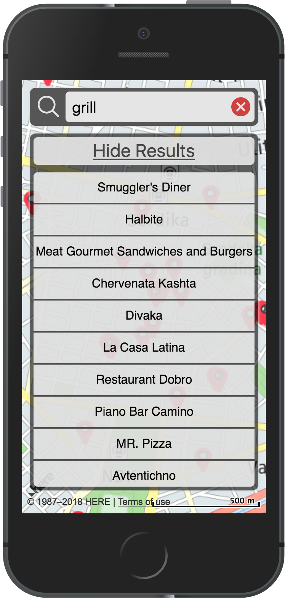

# Neighborhood-Here Project

## Table of Contents

* [About](#about)
* [How to run it](#how-to-run-it)
* [How to use it](#how-to-use-it)
* [Dependencies](#dependencies)

## About

The **Neighborhood-Here** project is Map app written in React and Redux. You can search different POI and get basic information about them. The project emphasizes using React and Redux to build the application and the usage of third-party APIs (HereMapsAPI)

## How to run it

1) Download or Clone the repository
2) Unzip the file if you have downloaded a ZIP
3) Install dependencies using **npm**:

        npm install

4) Start the application:

* The service worker is only enabled in the production environment, so if you want to use it build the project first. For more information check [Making a Progressive Web App](https://goo.gl/KwvDNy).

        npm run build
        npm install -g serve
        serve -s build

* Otherwise just start the server

        npm start

5) This will open new browser window/tab. If it doesn't navigate to:

        http://localhost:3000/

## How to use it

On the page you will see three main elements:

* Map
* Search Box
* List

* To view information about specific venue you can choose item either from the List or from the map Markers. The map will be centered on the opened InfoBubble for you.

***

* To search specific POI you are interested in just type in the Search Box and your results will update in both the **Map** and **List**

        
        

## Dependencies

* redux
* redux-thunk
* react-redux
* HereMapsAPI
* PropTypes
